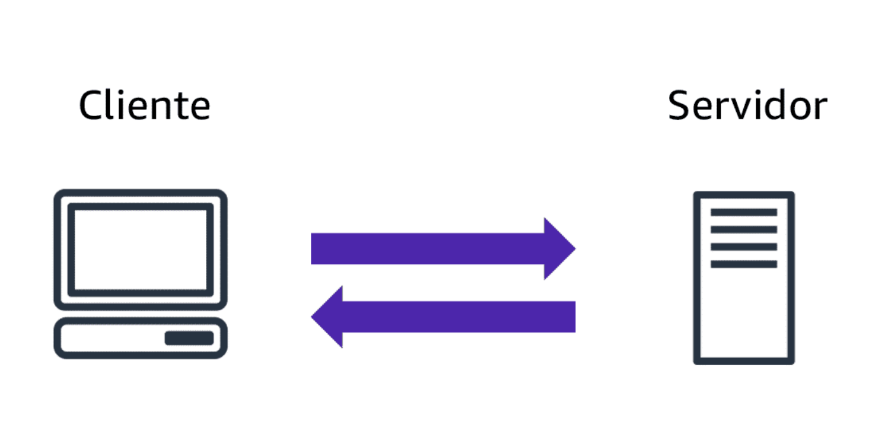

# Modelos de implantação da computação em nuvem

Ao selecionar uma estratégia de nuvem, a empresa precisa considerar fatores como os componentes de aplicação de nuvem necessários, as ferramentas preferenciais para gerenciar recursos e os requisitos da infraestrutura de TI legada.

Os três modelos de implantação de computação em nuvem são computação baseada na nuvem, on-premises e híbrida. 

## Implantação Baseada na Nuvem
- Execute todas as partes da aplicação na nuvem.
- Migre aplicações para a nuvem.
- Projete e crie novas aplicações na nuvem.

Em um modelo de implantação baseada na nuvem, você pode migrar aplicações para a nuvem ou projetar e criar novas aplicações na nuvem. Você pode criar essas aplicações em uma infraestrutura de baixo nível que precise do gerenciamento de sua equipe de TI. Você também pode criá-los usando serviços de nível superior que reduzem os requisitos de gerenciamento, arquitetura e scaling da infraestrutura principal.

Por exemplo, uma empresa poderia criar uma aplicação que consiste em servidores virtuais, bancos de dados e componentes de redes totalmente baseados na nuvem.

## Implantação baseada em on-Primeses

- Implante recursos usando ferramentas de virtualização e gerenciamento de recursos.
- Aumente a utilização de recursos usando tecnologias de virtualização e gerenciamento de aplicações.
A implantação on-premises também é conhecida como implantação de nuvem privada. Nesse modelo, os recursos são implantados on-premises usando ferramentas de virtualização e gerenciamento de recursos.

Por exemplo, você poderia executar aplicações em tecnologia totalmente mantida no seu data center on-premises. Embora esse modelo seja muito parecido com a infraestrutura de TI legada, a incorporação de tecnologias de virtualização e gerenciamento de aplicativos ajuda a aumentar a utilização de recursos.

# Benefícios da computação em nuvem

Considere por que uma empresa adota determinada abordagem de computação em nuvem para atender às necessidades de negócios.

Para saber mais sobre os benefícios, expanda cada uma das seis categorias a seguir.

## Troque despezas iniciais por despesas variavéis

Despesas iniciais se referem a data centers, servidores físicos e outros recursos nos quais você precisaria investir antes de usá-los. Despesas variáveis significam que você paga apenas pelos recursos de computação que consumir em vez de investir muito em data centers e servidores antes de saber como usá-los.

Ao adotar uma abordagem de computação em nuvem com o benefício de despesas variáveis, as empresas podem implementar soluções inovadoras enquanto economizam custos.

## Pare de gastar dinheiro para execultar e manter data centers

A computação em data centers costuma exigir que você gaste mais dinheiro e tempo gerenciando a infraestrutura e os servidores. 

Um benefício da computação em nuvem é poder se concentrar menos nessas tarefas e mais nas aplicações e clientes.

# O que é um modelo cliente-servidor?

Você acabou de aprender mais sobre a AWS e como quase toda a computação moderna usa um modelo cliente-servidor básico. Vamos recapitular o que é um modelo cliente-servidor.

Na computação, um cliente pode ser um navegador da web ou uma aplicação de desktop com o qual uma pessoa interage para fazer solicitações a servidores de computador. Um servidor pode ser um serviço, como o Amazon Elastic Compute Cloud (Amazon EC2), um tipo de servidor virtual.

Por exemplo, suponha que um cliente faça uma solicitação de uma matéria jornalística, a pontuação em um jogo on-line ou um vídeo engraçado. O servidor avalia os detalhes dessa solicitação e a atende retornando as informações ao cliente.

