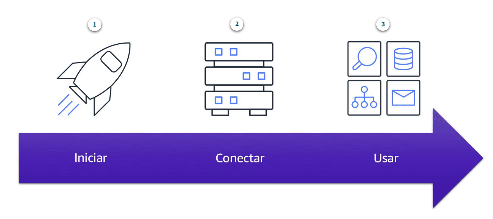

# Amazon Elastic Compute Cloud (Amazon EC2)

O Amazon Elastic Compute Cloud (Amazon EC2)(opens in a new tab) fornece capacidade computacional segura e redimensionável na nuvem como instâncias do Amazon EC2. 

Imagine que você é responsável pela arquitetura dos recursos de sua empresa e precisa dar suporte a novos sites. Com os recursos on-premises tradicionais, você precisa fazer o seguinte:

- Gastar dinheiro antecipadamente para comprar o hardware.
- Aguardar até que os servidores sejam entregues para você.
- Instalar os servidores em seu data center físico.
- Fazer todas as configurações necessárias.

Em comparação, com uma instância do Amazon EC2, você pode usar um servidor virtual para executar aplicações na nuvem AWS.

- Você pode provisionar e iniciar uma instância do Amazon EC2 em minutos.
- Você pode parar de usar a instância quando terminar de executar uma carga de trabalho.
- Você paga apenas pelo tempo de computação em que uma instância está em execução, não quando ela é interrompida ou terminada.
- Você pode economizar custos pagando apenas pela capacidade do servidor necessária ou desejada.
Como o Amazon EC2 funciona

# Como o Amazon EC2 funciona

