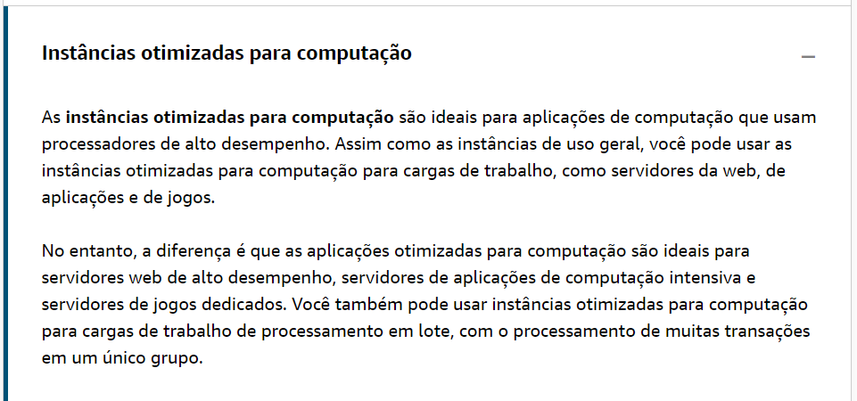
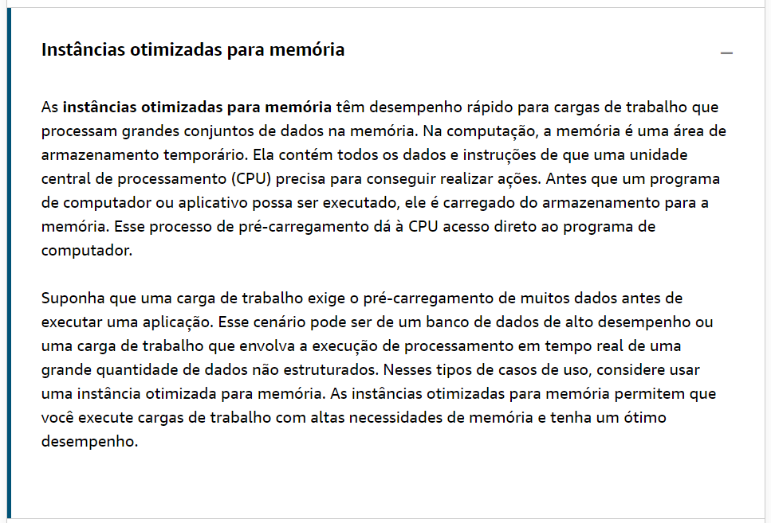
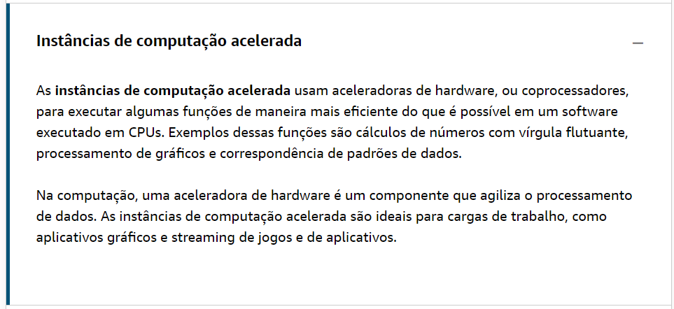
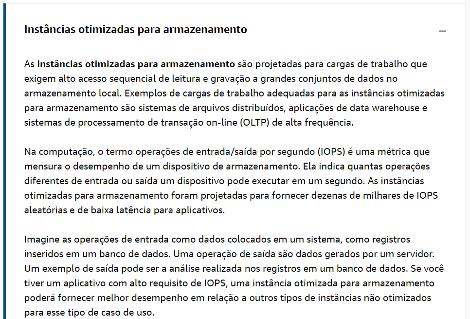

# Tipos de instâncias do Amazon EC2

Os tipos de instâncias do Amazon EC2(opens in a new tab) são otimizados para tarefas diferentes. Ao selecionar um tipo de instância, considere as necessidades específicas de suas cargas de trabalho e suas aplicações. Isso pode incluir requisitos para recursos de computação, memória ou armazenamento.

